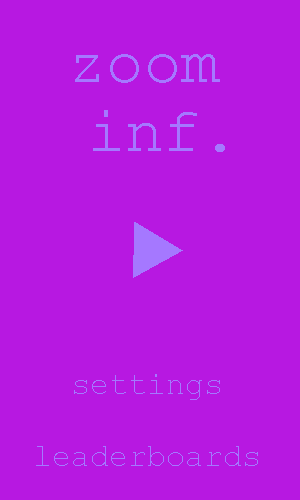
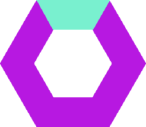

# Zoom inf.
A recursion game.

# Требования пользователя
## Программные интерфейсы
Игра будет написана на GML. 
Также будет осуществляться взаимодействие с сервисами Google Play для хранения рекордов игроков и показ реламы от Admob.

## Интерфейс пользователя
При запуске игры открывается главный экран. 

В центре находится кнопка старта игры. Она же является и игровым полем.
Ниже – кнопки настроек и таблицы рекордов. Экран настроек будет включать в себя регулировку звука и сброс прогресса.

При старте игры многоугольник в центре расширяется и становится игровым полем.

Маленький треугольинк сверху – игрок. Он должен добраться до нового игрового поля, находящегося в центре. 
Этому препятствуют кольца, находящиеся между игроком и новым игровым полем. 
Игрок может двигаться только вперёд, и чтобы достигнуть центра, ему надо взаимодействовать с кольцами.
Одно поле может иметь до четырёх-пяти колец. На поле отображаются только два кольца – текущее и следующее. 
Пройденные кольца расширяютя и исчезают за экраном по мере продвижения игрока.

Пока есть два типа колец:

1. 

При нажатии на светлую часть она исчезает и открывает проход.

2. 

Кольцо можно вращать, тем самым двигая его пустую часть в нужную область.

При достижении центра новое игровое поле расширяется и становится главным полем, 
в котором тоже находятся кольца и ещё одно игровое поле, до которого нужно добраться.

Очки начисляются за каждое пройденное игровое поле. 

Планируется релиз на Google Play. Монетизация будет осуществляться путём показа рекламы.

Также поле постоянно расширяется. Если оно станет слишком большим, игра будет окончена. 
Двигаясь вперёд, игрок сужает поле обратно.

## Характеристики пользователей
Игра нацелена на любителей игр в духе Super Hexagon, Pivvot, Barrier X.

## Предположения и зависимости
Без Интернета не будет доступа ни к рекламе, ни к таблице рекордов.

# Системные требования
Смартфон с Android 4.4 и выше.

## Функциональные требования
1. Интегрирование таблицы рекордов Google Play.
2. Интегрирование показа рекламы от AdMob.
3. Пауза.
4. Исчезание кольца первого типа при нажатии.
5. Движение второго кольца при нажатии и повороте.

## Нефункциональные требования
1. Игра должна держать 30 fps на большинстве устройств.
2. Игра не должна весить более 50 Мб.

